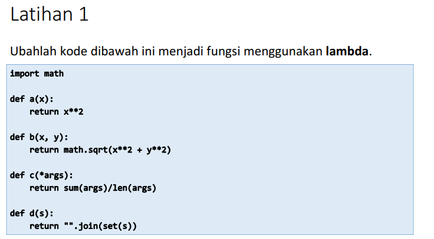

# Tugas Pertemuan 10 Bahasa Pemrograman - Lab 6 *(repo: p10_lab6)*

<hr>


Pada mata kuliah Bahasa Pemrograman Pertemuan 10, saya diberi materi oleh dosen yaitu. Fungsi, Module dan Package.<br>

## Latihan

Pada pembahasan kali ini saya diberikan tugas oleh dosen untuk mengerjakan sebuah program sederhana dalam sebuah Tugas Latihan.

* Dosen memberikan tugas seperti berikut :<br>
 <br>

* Setelah saya membaca dan memahami materi yang diberikan oleh Dosen, dan mencari referensi dari Internet, entah itu dari Forum Programmer ataupun Modul-modul yang dishare oleh seseorang<br>

* Seperti berikut source code yang telah saya kerjakan untuk Tugas Latihan :<br>
``` python
import math

print("====================================")
print("Nama : FEBRO HERDYANTO")
print("NIM : 312010043")
print("Kelas : TI.20.B.1")
print("Mata Kuliah : Bahasa Pemrograman")
print("====================================")


def a(x):
    return x ** 2


def a2(x): x ** 2


print("1. Mengubah function menggunakan Lambda \n   def a(x): \n \t   return x ** 2")
print("   Hasil : def a2(x): x ** 2")


def b(x, y):
    return math.sqrt(x ** 2 + y ** 2)


def b2(x, y): math.sqrt(x ** 2 + y ** 2)


print("-----------------------------------------")
print("2. Mengubah function menggunakan Lambda \n   def b(x, y): \n \t   return math.sqrt(x ** 2 + y ** 2)")
print("   Hasil : def b2(x, y): math.sqrt(x ** 2 + y ** 2)")


def c(*args):
    return sum(args) / len(args)


def c2(*args): sum(args) / len(args)


print("-----------------------------------------")
print("3. Mengubah function menggunakan Lambda \n   def c(*args): \n \t   return sum(args) / len(args)")
print("   Hasil : def c2(*args): sum(args) / len(args)")


def d(s):
    return "".join(set(s))


def d2(s): "".join(set(s))


print("-----------------------------------------")
print("4. Mengubah function menggunakan Lambda \n   def d(s): \n \t   return "".join(set(s))")
print("   Hasil : def d2(s): "".join(set(s))")
```

* Dari hasil source code diatas sebagai berikut :<br>


* Dalam Tugas Latihan diatas saya menggunakan bahasa Lambda

<hr>

## Praktikum

Selain tugas latihan yang diberikan oleh dosen, saya juga diberi tugas praktikum oleh Dosen. Yaitu membuat progam sederhana menggunakan fungsi. Yang menampilkan Data Mahasiswa. <br>

* Seperti berikut tugas yang diberikan oleh dosen :<br>
<br>

* Seperti biasa, setelah saya membaca serta memahami materi yang berikan oleh dosen dan mencari referensi tambahan dari Internet, akhirnya saya bisa mengerjakan tugas pertemuan 10 (Praktikum).<br>

* Inilah source code dari program sederhana saya :<br>
``` python
from prettytable import PrettyTable

print("=======================================")
print("Nama : FEBRO HERDYANTO")
print("NIM : 312010043")
print("Kelas : TI.20.B.1")
print("Mata Kuliah : Bahasa Pemrograman")
print("Tugas : Praktikum Lab 6 - Pertemuan 10")
print("=======================================")

tampunglist = {}
x = PrettyTable()


def tambah():
    print("========== TAMBAH DATA NILAI MAHASISWA ==========")
    tnama = input("Masukkan Nama Mahasiswa : ")
    tnim = input("Masukkan NIM Mahasiswa : ")
    ttugas = int(input("Masukkan Nilai Tugas Mahasiswa : "))
    tuts = int(input("Masukkan Nilai UTS Mahasiswa : "))
    tuas = int(input("Masukkan Nilai UAS Mahasiswa : "))
    takhir = 0.3 * float(ttugas) + 0.35 * float(tuts) + 0.35 * float(tuas)
    tampunglist[tnama] = tnim, ttugas, tuts, tuas, takhir


def tampilkan():
    print("========== LIHAT DATA NILAI MAHASISWA ==========")
    no = 0
    x.field_names = ["NO", "NAMA", " NIM", "TUGAS", "UTS", "UAS", "AKHIR"]
    for tdata in tampunglist.items():
        no += 1
        x.add_row([no, tdata[0], tdata[1][0], tdata[1][1], tdata[1][2], tdata[1][3], tdata[1][4]])
    print(x)


def hapus(hxsiapa):
    print("========== HAPUS DATA NILAI MAHASISWA ==========")
    if hxsiapa in tampunglist.keys():
        print(f"DATA {hxsiapa} BERHASIL DIHAPUS")
        del tampunglist[hxsiapa]
    else:
        print("!!! === ERROR! DATA TIDAK TERSEDIA === !!!")


def ubah(xsiapa):
    if xsiapa in tampunglist.keys():
        print("Data apa yang akan diubah ? : ")
        mhs = int(input(" 1. NIM \n 2. Nilai Tugas \n 3. Nilai UTS \n 4. Nilai UAS\n Pilih dengan angka (1/2/3/4) : "))
        if mhs == 1:
            ubahnim = input("Silahkan masukan NIM yang benar : ")
            i = 0
            vtug = tampunglist[xsiapa][1]
            vuts = tampunglist[xsiapa][2]
            vuas = tampunglist[xsiapa][3]
            vakh = tampunglist[xsiapa][4]
            tampunglist[xsiapa] = ubahnim, vtug, vuts, vuas, vakh
            x.field_names = ["No", "NAMA", " NIM", "TUGAS", "UTS", "UAS", "AKHIR"]
            for tdata in tampunglist.items():
                i += 1
                x.add_row([i, tdata[0], tdata[1][0], tdata[1][1], tdata[1][2], tdata[1][3], tdata[1][4]])
            print(x)
        elif mhs == 2:
            ubahtugas = int(input("Masukkan Nilai Tugas yang benar : "))
            i = 0
            vnim = tampunglist[xsiapa][0]
            vuts = tampunglist[xsiapa][2]
            vuas = tampunglist[xsiapa][3]
            vakh = tampunglist[xsiapa][4]
            tampunglist[xsiapa] = vnim, ubahtugas, vuts, vuas, vakh
            x.field_names = ["No", "NAMA", " NIM", "TUGAS", "UTS", "UAS", "AKHIR"]
            for tdata in tampunglist.items():
                i += 1
                x.add_row([i, tdata[0], tdata[1][0], tdata[1][1], tdata[1][2], tdata[1][3], tdata[1][4]])
            print(x)
        elif mhs == 3:
            ubahuts = int(input("Masukkan Nilai UTS yang benar : "))
            i = 0
            vnim = tampunglist[xsiapa][0]
            vtug = tampunglist[xsiapa][1]
            vuas = tampunglist[xsiapa][3]
            vakh = tampunglist[xsiapa][4]
            tampunglist[xsiapa] = vnim, vtug, ubahuts, vuas, vakh
            x.field_names = ["No", "NAMA", " NIM", "TUGAS", "UTS", "UAS", "AKHIR"]
            for tdata in tampunglist.items():
                i += 1
                x.add_row([i, tdata[0], tdata[1][0], tdata[1][1], tdata[1][2], tdata[1][3], tdata[1][4]])
            print(x)
        elif mhs == 4:
            ubahuas = int(input("Masukkan Nilai UAS yang benar : "))
            i = 0
            vnim = tampunglist[xsiapa][0]
            vtug = tampunglist[xsiapa][1]
            vuts = tampunglist[xsiapa][2]
            vakh = tampunglist[xsiapa][4]
            tampunglist[xsiapa] = vnim, vtug, vuts, ubahuas, vakh
            x.field_names = ["No", "NAMA", " NIM", "TUGAS", "UTS", "UAS", "AKHIR"]
            for tdata in tampunglist.items():
                i += 1
                x.add_row([i, tdata[0], tdata[1][0], tdata[1][1], tdata[1][2], tdata[1][3], tdata[1][4]])
            print(x)
        else:
            print("!!! === ERROR! Anda Memasukkan Pilihan yang Salah === !!!")
    else:
        print("!!! === ERROR! DATA TIDAK TERSEDIA === !!!")


print("===== APLIKASI PENGOLAHAN DATA NILAI MAHASISWA =====")
while True:
    print("MENU : \n 1. Tambah Data \n 2. Lihat Data \n 3. Ubah Data \n 4. Hapus Data \n 5. Keluar Aplikasi")
    pilih = int(input("Pilih Menu (1/2/3/4/5) : "))
    if pilih == 1:
        tambah()
    elif pilih == 2:
        tampilkan()
    elif pilih == 3:
        print("========== UBAH DATA NILAI MAHASISWA ==========")
        print("Data siapa yang akan diubah ?")
        siapa = input("Masukkan Nama Mahasiswa yang akan diubah : ")
        ubah(siapa)
    elif pilih == 4:
        print("========== HAPUS DATA NILAI MAHASISWA ==========")
        print("Data siapa yang akan diubah ?")
        hsiapa = input("Masukkan Nama Mahasiswa yang akan diubah : ")
        hapus(hsiapa)
    elif pilih == 5:
        break
    else:
        print("!!! === ERROR! Anda Memasukkan Pilihan yang Salah === !!!")
``` 

* Pada tugas praktikum saya menggunakan fitur function yang ada di Python. Dan menggunakan media penyimpanan data berupa Dictionary<br>
Saya akan menjelaskan dikit mengenai fitur-fitur yang ada dalam program sederhana saya.<br>
Ketika program di run pada pertama kali, maka akan muncul tampilan seperti ini :<br>
<br>
Terdapat 5 Pilihan menu, yaitu :<br>
1. Tambah Data<br>
2. Lihat Data<br>
3. Ubah Data<br>
4. Hapus Data<br>
5. Keluar<br>

* **Fitur Tambah Data Nilai Mahasiswa**<br>
System akan menjalankan fitur ini ketika user mengetikkan perintah **1** pada pilihan **Pilih Menu (1/2/3/4/5)**<br>
Inilah tampilan fitur Tambah Data <br>
<br>
User akan diminta untuk memasukkan data : Nama, NIM, Nilai Tugas, Nilai UTS, dan Nilai UAS<br>
System akan menampilkan menu<br>

* **Fitur Lihat Data Nilai Mahasiswa**<br>
System akan menjalankan fitur ini ketika user mengetikkan perintah **2** pada pilihan **Pilih Menu (1/2/3/4/5)**<br>
Inilah tampilan fitur Lihat Data <br>
<br>
System akan menampilkan data sesuai apa yang dimasukkan user di fitur Tambah Data. Ada kolom Nilai Akhir pada fitur ini, Kolom tersebut akan terisi otomatis oleh system dengan rumus/ketentuan *30% dari Nilai Tugas, 35% dari Nilai UTS, 35% dari Nilai UAS*<br>

* **FItur Ubah Data Nilai Mahasiswa**<br>
System akan menjalankan fitur ini ketika user mengetikkan perintah **3** pada pilihan **Pilih Menu (1/2/3/4/5)**<br>
Inilah tampilan fitur Ubah Data <br>
<br>
Pada fitur ini user akan diminta untuk memilih data siapa yang akan diubah dan data apa yang akan dirubah<br>
Setelah user memilih data, *Misalnya user ingin merubah NIM dari mahasiswa dengan nama febro* , Maka akan muncul tampilan seperti ini :<br>
<br>
Diatas adalah hasil dari data yang dirubah.<br>

* **Fitur Hapus Data Nilai Mahasiswa**<br>
System akan menjalankan fitur ini ketika user mengetikkan perintah **4** pada pilihan **Pilih Menu (1/2/3/4/5)**<br>
Sebelum saya menjalankan fitur ini, saya akan menambahkan 1 data lagi dengan nama Rega<br>
<br>
Setelah data Rega tersimpan, saya akan menjalankan fitur Hapus Data, seperti inilah tampilannya :<br>
<br>
Pada fitur ini, user akan diminta untuk memasukkan data siapa yang akan dihapus, setelah penghapusan selesai, system akan menampilkan pesan bahwa data sudah berhasil dihapus<br>

* **Fitur Keluar dari Aplikasi**<br>
System akan menjalankan fitur ini ketika user mengetikkan perintah **5** pada pilihan **Pilih Menu (1/2/3/4/5)**<br>
Fitur ini sangat singkat, yaitu akan menutup system dan keluar dari aplikasi yang telah dijalankan<br>
Seperti ini tampilan dari fitur keluar<br>
<br>
<hr>

### Itulah tugas yang telah saya buat untuk memenuhi nilai Pertemuan 10 - Bahasa Pemrograman - Teknik Informatika - TI.20.B.1 - Universitas Pelita Bangsa

### Terima Kasih dan Sampai Jumpa di Tugas-Tugas Lainnya (Febro Herdyanto - 312010043)